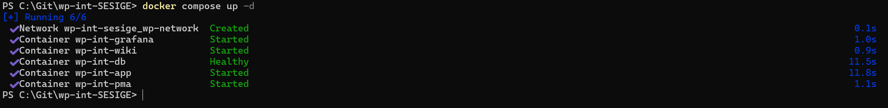
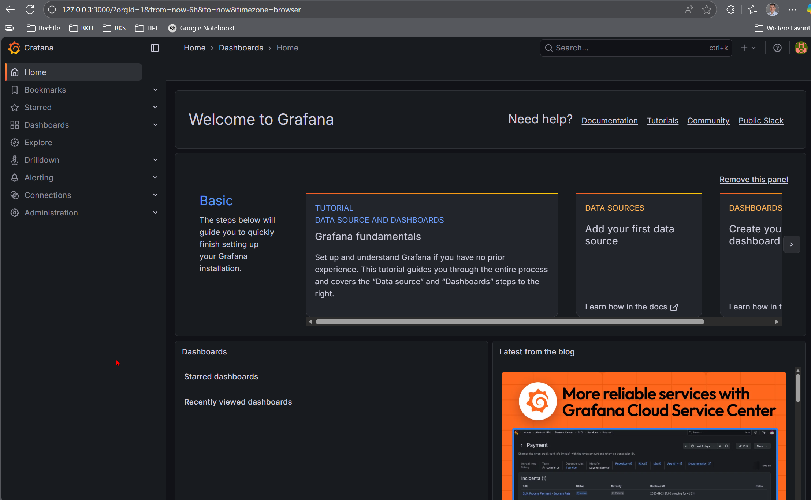
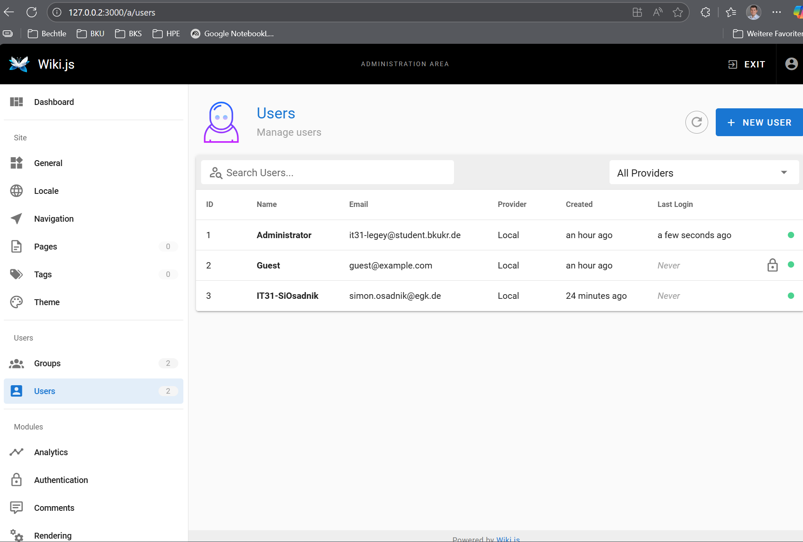

# Dokumentation der KI-Zusammenarbeit

Wir haben die `docker-compose.yml` und die Projektstruktur interaktiv mit einer KI (Gemini) erarbeitet. Hier sind die wichtigsten Prompts und die daraus resultierenden Lösungen.

### 1. Basis-Setup & Image-Auswahl
**Prompt:**
> "Erstelle eine docker-compose.yml für eine WordPress Entwicklungsumgebung. Wir brauchen WordPress, MariaDB und phpMyAdmin. Welche Image-Versionen sind für eine stabile lokale Entwicklung empfehlenswert?"

**KI-Antwort / Lösung:**
* **MariaDB:** Empfehlung für `mariadb:lts` (Long Term Support) statt `latest`, um Stabilität zu gewährleisten.
* **WordPress:** `wordpress:latest` für die aktuellste Entwicklerversion.
* **phpMyAdmin:** Offizielles Image `phpmyadmin/phpmyadmin`.

### 2. Abhängigkeiten & Healthchecks
**Prompt:**
> "Wie verhindern wir, dass der WordPress-Container abstürzt, weil die Datenbank beim Start noch nicht bereit ist? `depends_on` allein reicht oft nicht."

**KI-Antwort / Lösung:**
* Einfaches `depends_on` startet nur den Container, prüft aber nicht die Applikation.
* **Lösung:** Hinzufügen eines `healthcheck` im Datenbank-Service (prüft `healthcheck.sh --connect`).
* Im WordPress-Service wird `depends_on` erweitert um `condition: service_healthy`. Damit wartet WP effektiv, bis die DB Verbindungen akzeptiert.

### 3. Volumes & Persistenz (Bind-Mount vs. Named Volume)
**Prompt:**
> "Wir müssen lokal am Code (Themes/Plugins) arbeiten, aber die Datenbank soll einfach nur ihre Daten behalten. Wie konfigurieren wir die Volumes?"

**KI-Antwort / Lösung:**
* **Datenbank:** Nutzung eines **Named Volume** (`db_data`), da wir hier nicht manuell in die Dateien eingreifen müssen -> Reine Datenpersistenz.
* **WordPress:** Nutzung eines **Bind-Mounts** (`./wordpress/wp-content:/var/www/html/wp-content`). Das synchronisiert den lokalen Ordner mit dem Container, sodass Code-Änderungen sofort sichtbar sind.

### 4. Sicherheit & Konfiguration
**Prompt:**
> "Wie gehen wir mit Datenbank-Passwörtern um? Sie dürfen nicht im Git-Repository landen."

**KI-Antwort / Lösung:**
* Nutzung einer `.env` Datei für sensible Variablen.
* Erstellung einer `.env.example` (mit Dummy-Werten) für das Repository.
* Aufnahme von `.env` in die `.gitignore`.

### 5. Port-Konflikte & Netzwerk
**Prompt:**
> "Die Services sollen auf Port 8080 (WP) und 8081 (PMA) erreichbar sein. Wie stellen wir das ein?"

**KI-Antwort / Lösung:**
* Mapping der Ports in der Compose-File: `"${WP_PORT}:80"` und `"${PMA_PORT}:80"`.
* Alle Container werden in ein gemeinsames Bridge-Network (`wp-network`) gehängt, damit sie untereinander per Servicenamen (`db`, `wordpress`) kommunizieren können.

## Erweiterung Wiki und Grafana

### Problemstellung: Port-Konflikt

> "Die Anforderung war, das Wiki und Grafana hinzuzufügen. Beide Container lauschen intern auf Port 3000. Würde man beide auf localhost:3000 binden, würde Docker beim Starten abbrechen ("Bind for 0.0.0.0:3000 failed: port is already allocated")."

### Lösung Portkonflikt via Loopback:

> "Anstatt "krumme" Ports zu verwenden (z.B. Wiki auf 3000, Grafana auf 3001), wurde das Loopback-Interface des Hosts genutzt. Jedem Dienst wurde eine eigene lokale IP-Adresse zugewiesen:

- Wiki bindet an 127.0.0.2

- Grafana bindet an 127.0.0.3

Dies ermöglicht es, dass beide Dienste sauber auf Port 3000 erreichbar sind, ohne sich gegenseitig zu blockieren.

| Tool | URL (IP:Port) | Beschreibung & Einsatzzweck |
| :--- | :--- | :--- |
| **WordPress** | [http://localhost:8080](http://localhost:8080) | **Intranet-Frontend.** Hier läuft das eigentliche Mitarbeiter-Portal. |
| **phpMyAdmin**| [http://localhost:8081](http://localhost:8081) | **Datenbank-Verwaltung.** Grafische Oberfläche zur Administration der MariaDB (z.B. für Backups oder SQL-Queries). |
| **Wiki** | [http://127.0.0.2:3000](http://127.0.0.2:3000) | **Wissensdatenbank (Wiki.js).** Zentrale Ablage für IT-Dokumentation, Anleitungen und Onboarding-Infos. |
| **Grafana** | [http://127.0.0.3:3000](http://127.0.0.3:3000) | **Monitoring-Dashboard.** Visualisierung von Systemdaten und Metriken (z.B. Serverauslastung, Uptime). |

##Screenshots

### Nachweis das alle Container gestartet sind

### Nachweis Weboberfläche Grafana

### Nachweis Weboberfläche Grafana

