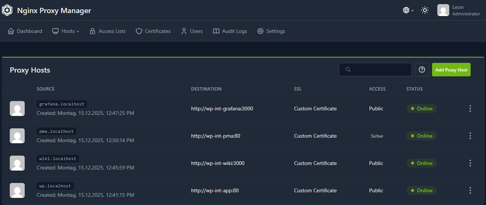
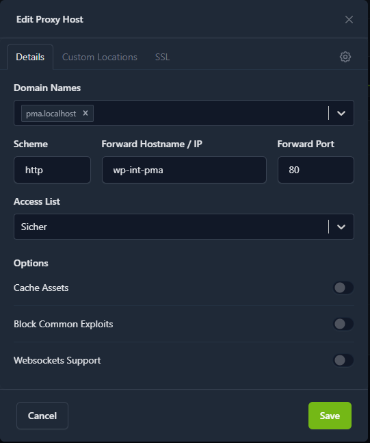
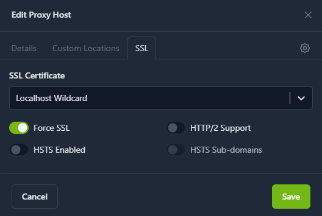
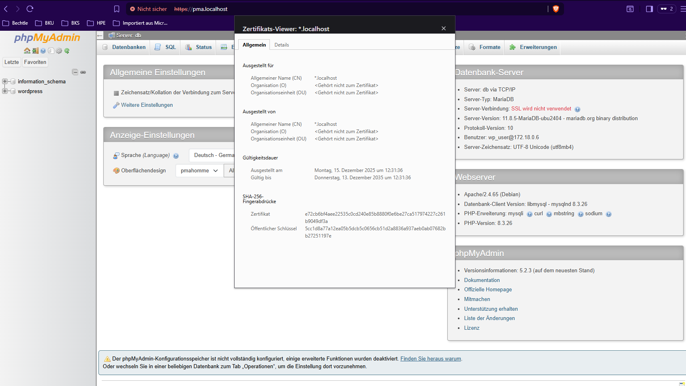
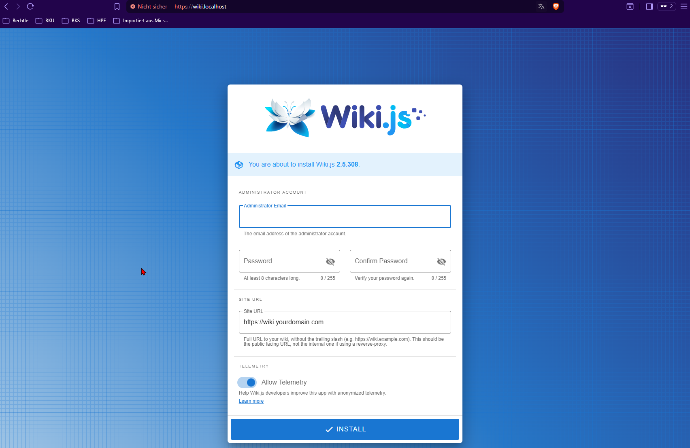
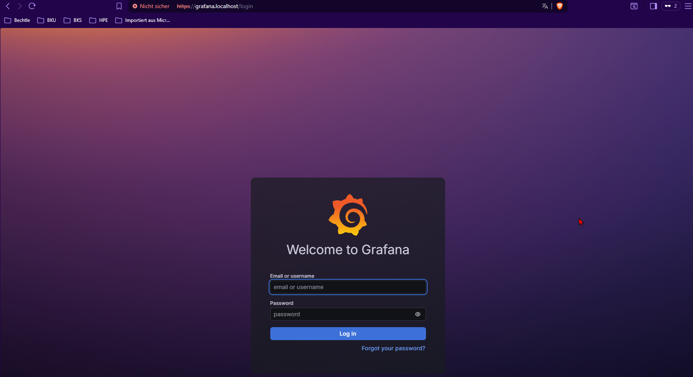
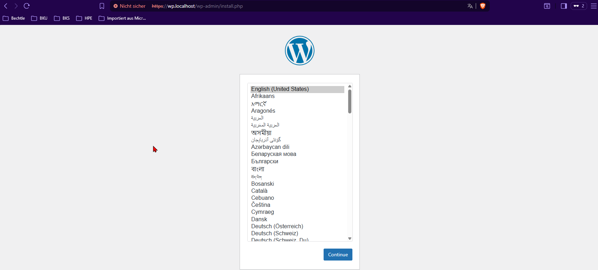
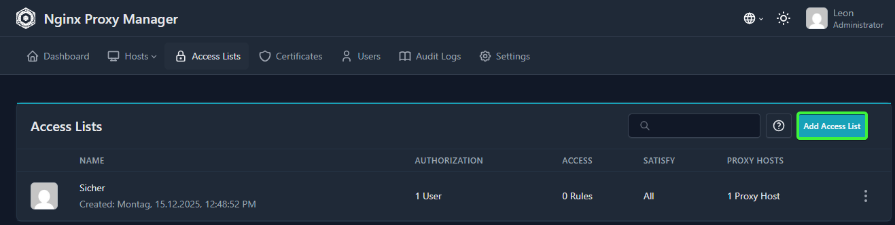
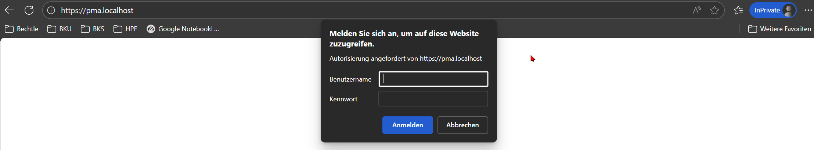
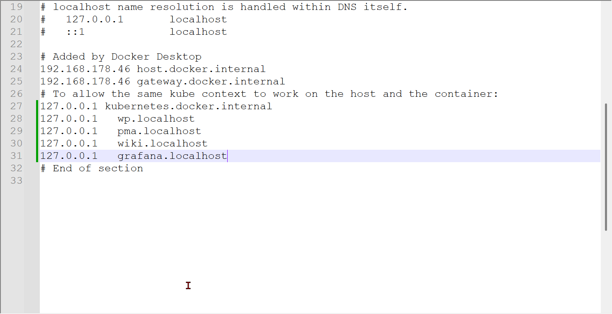

# Projekt: WordPress Intranet Stack mit Nginx Proxy Manager
**Gruppe:** Simon Osadnik, Sebastian Mayer, Leon Gey

## 📋 Projektbeschreibung
Dieses Projekt stellt eine vollständige lokale Entwicklungsumgebung bereit, die WordPress, ein Wiki, ein Monitoring-System (Grafana) und Datenbank-Tools umfasst. 

**Architektur-Upgrade:** Das System wurde von einer ursprünglich port-basierten Architektur auf eine professionelle **Service-Orientierte Architektur mit Reverse Proxy** umgestellt. Es werden keine Ports mehr nach außen geöffnet; alle Dienste sind sauber über **HTTPS-Subdomains** erreichbar.

---

## 🚀 Zugriff auf die Dienste

| Dienst | URL | Beschreibung |
| :--- | :--- | :--- |
| **WordPress** | [https://wp.localhost](https://wp.localhost) | Intranet-Portal. Login: `wp_user` / `Start123` |
| **phpMyAdmin**| [https://pma.localhost](https://pma.localhost) | **Geschützt!** Erst Access-Login (`admin`/`sicher`), dann DB-Login. |
| **Wiki** | [https://wiki.localhost](https://wiki.localhost) | Wissensdatenbank. |
| **Grafana** | [https://grafana.localhost](https://grafana.localhost) | Monitoring. |
| **Proxy Admin** | [http://localhost:81](http://localhost:81) | Nginx Proxy Manager UI. |

*(Hinweis: Da wir lokal arbeiten und Self-Signed Zertifikate nutzen, muss die Sicherheitswarnung im Browser akzeptiert werden.)*

---

## 🔄 Architektur-Entscheidungen (Änderungsprotokoll)

Auf Anforderung der Aufgabenstellung haben wir unsere Umgebung wie folgt optimiert:

### 1. Von offenen Ports zum Reverse Proxy
* **Ausgangslage:** Ursprünglich waren Dienste über Ports wie `:8080` oder `:3000` erreichbar. Um Portkonflikte zu vermeiden, nutzten wir zeitweise Loopback-Adressen (`127.0.0.2`).
* **Neue Lösung:** Wir haben die Sektion `ports:` bei allen App-Containern entfernt. Die Container liegen nun isoliert im internen Netz `wp-network`.
* **Vorteil:** Erhöhte Sicherheit (kein direkter Zugriff mehr) und saubere URLs durch den **Nginx Proxy Manager**.

### 2. HTTPS & Sicherheit
* **Verschlüsselung:** Alle Dienste wurden von HTTP auf HTTPS umgestellt ("Force SSL" im Proxy) unter Verwendung eines Wildcard-Zertifikats (`*.localhost`).
* **Access Control:** phpMyAdmin wurde zusätzlich durch eine vorgeschaltete Passwortabfrage (Basic Auth) abgesichert.

---

## 🤖 Dokumentation der KI-Zusammenarbeit (Gemini)

Wir haben die `docker-compose.yml` iterativ mit einer KI erarbeitet. Hier die wichtigsten Lernschritte:

### 1. Basis-Setup & Stabilität
**Prompt:** *"Wie verhindern wir, dass WordPress abstürzt, weil die DB noch nicht bereit ist?"*
* **Lösung:** `depends_on` reicht nicht. Wir haben einen `healthcheck` in der Datenbank eingefügt (`healthcheck.sh --connect`) und WordPress wartet nun auf `condition: service_healthy`.

### 2. Daten-Persistenz
**Prompt:** *"Wie konfigurieren wir Volumes für Entwicklung vs. Datenbank?"*
* **Lösung:** * Datenbank: **Named Volume** (`db_data`) für reine Datenhaltung.
    * WordPress: **Bind-Mount** (`./wordpress/wp-content`) um Code-Änderungen lokal bearbeiten zu können.

### 3. Proxy-Integration (Finale Phase)
**Prompt:** *"Das System soll über Subdomains erreichbar sein, Ports sollen geschlossen werden."*
* **Lösung:**
    * Integration von `nginx-proxy-manager:2`.
    * Hinweis der KI, eine separate `mariadb:10.5` für den Proxy zu nutzen, um Versionkonflikte mit der Haupt-DB zu vermeiden.
    * Anleitung zur Erstellung von Self-Signed Zertifikaten für `localhost`.

---

## 📸 Screenshots & Nachweise

### 1. Nginx Proxy Manager Dashboard
Nachweis: Alle 4 Dienste (WordPress, Wiki, Grafana, PMA) sind aktiv und grün.


### 2. Detail-Konfiguration (Beispiel WordPress)
Nachweis der Weiterleitung auf den Container-Namen `wp-int-app` und erzwungenes SSL.



### 3. WordPress, Wiki, Grafana und phpMyAdmin laufen unter HTTPS
Die URL ist `wp.localhost` – Verbindung ist verschlüsselt.





### 4. phpMyAdmin Zugriffsschutz
Der Browser fordert **vor** dem Laden der Seite Benutzername und Passwort.

**Problembehebung:** Initial erhielten wir einen "403 Forbidden" Fehler. Die Lösung war die Aktivierung der Option **"Satisfy Any"** in der Access List Konfiguration. Dies stellt sicher, dass Nginx den Zugriff gewährt, sobald die Passwort-Authentifizierung erfolgreich ist.




### 5. Zertifikat Erstellung und Hinterlegung
Erstellung des Zertifikates in der Git Bash mit dem Befehl:
```bash
openssl req -nodes -new -x509 -keyout key.pem -out cert.pem -days 3650 -subj "/CN=*.localhost"`

---

## 🚀 Installation & Steuerung

Damit die Umgebung korrekt läuft, müssen vor dem ersten Start folgende Schritte durchgeführt werden.

### 1. Erst-Einrichtung (Einmalig)

#### A. Ordnerstruktur erstellen
Da die Proxy-Daten persistent in lokalen Ordnern gespeichert werden, müssen diese existieren. Führe dies in der **PowerShell** im Projektordner aus:

```powershell
mkdir proxy
mkdir proxy/data
mkdir proxy/letsencrypt

#### Host-Datei anpassen (windows)
Damit Adressen wie `wp.localhost` auf deinen eigenen PC zeigen, muss die Windows-Hosts-Datei editiert werden.

1. Öffne einen Text-Editor (z. B. Notepad) als Administrator.

2. Öffne die Datei: C:\Windows\System32\drivers\etc\hosts

3. Füge am Ende folgende Zeile hinzu:
> `127.0.0.1  wp.localhost pma.localhost wiki.localhost grafana.localhost`



### Docker Container Steuern (Overview)
| Befehl | Wirkung |
| :--- | :--- |
| `docker compose up -d` | **Alles starten.** Fährt die gesamte Umgebung im Hintergrund hoch. |
| `docker compose up -d --force-recreate` | **Erzwungener Neustart** Wichtig, wenn Configs geändert wurden (baut Container neu).. |
| `docker compose stop grafana` | **Nur Grafana anhalten.** Stoppt den Container, ohne ihn zu löschen. |
| `docker compose restart db` | **Datenbank neu starten.** Nützlich, falls die Verbindung mal hängt. |
| `docker compose logs -f wordpress` | **Live-Logs ansehen.** Zeigt die Ausgaben von WordPress in Echtzeit (Beenden mit `Strg + C`). |